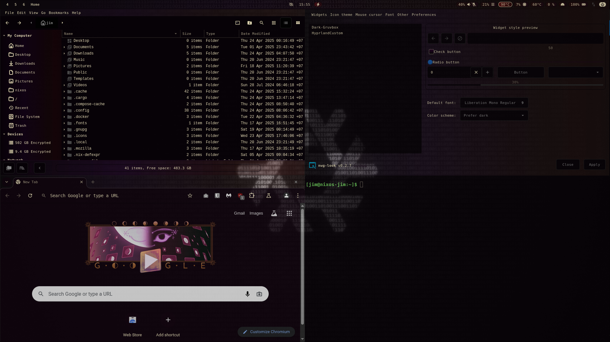

# gtk-theme

Overriding [`gtk-theme`](https://gitlab.gnome.org/GNOME/gtk/-/tree/gtk-4.0/gtk/theme/Adwaita).



---

---

# installation

| requirements |     |
| ------------ | --- |
| `node`       |     |

```sh
git clone <repository-name>

npm install
```

### base theme

Copy [`gtk-theme-adwaita`](https://gitlab.gnome.org/GNOME/gtk/-/tree/gtk-4.0/gtk/theme/Adwaita) content in `static/theme/`.

Any theme may be used instead as long as following the structure:

```
static/
  theme/
    some-stylesheet.scss
    assets/
      some-assets.(png|svg|...)
```

# build

```sh
npm run build:dev # development
npm run build # production
```

Then copy the build (`dist/`) to the `themes` directory.

e.g `~/.themes` with [`nwg-look`](https://github.com/nwg-piotr/nwg-look)

### output

```
/dist
  index.theme

  /assets
  /gtk-3.0
    gtk.css
  /gtk-4.0
    gtk.css
```

---

---

# nixos

Example to add to `nixos` configuration with `home-manager`:

```nix
{ pkgs, lib, ... }:

let
  USERNAME = "username";

  GTK_THEME_NAME = "GtkThemeCustom";
  GTK_THEME_DIRECTORY = /path/to/gtk-theme/dist;
in
{
  environment.systemPackages = with pkgs; [
    nwg-look
  ];

  home-manager = {
    users.${USERNAME} = {
      home = {
        file = lib.mkMerge [
          {
            ".themes/${GTK_THEME_NAME}" = {
              source = GTK_THEME_DIRECTORY;
              recursive = true;
            };
          }
        ];
      };

      # hyprland
      wayland.windowManager.hyprland = {
        settings = {

          env = [
            # "GTK_DEBUG, interactive"
            "GTK_THEME, ${GTK_THEME_NAME}"
          ];
        };
      };
    };
  };
}
```
